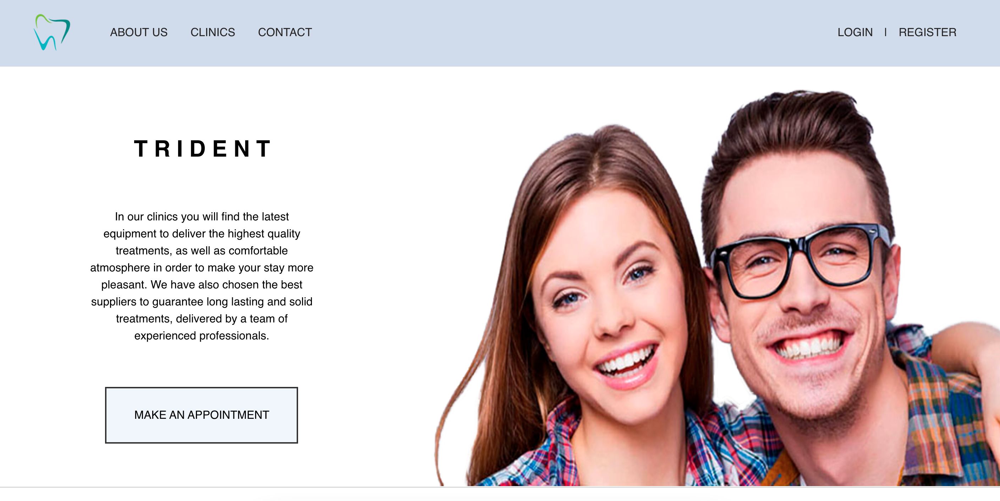
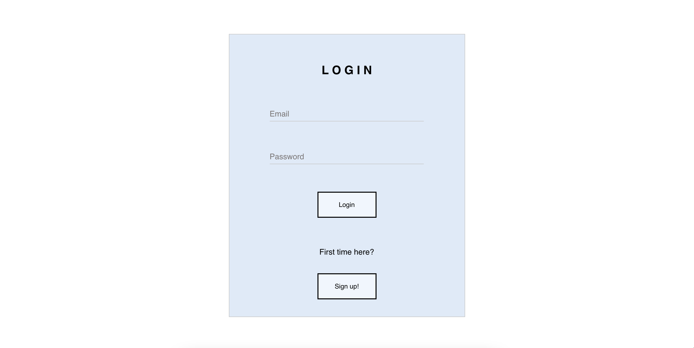
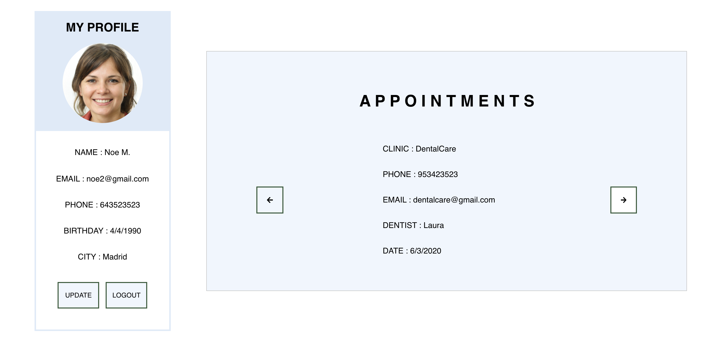
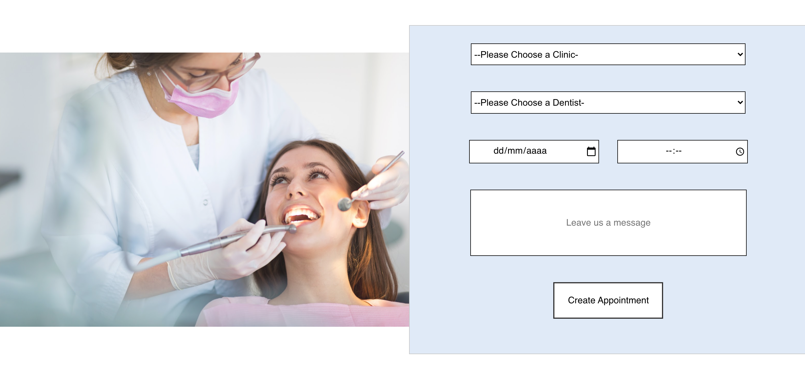

<h1 align="center">
   🦷 Dental Clinic Frontend 🦷
</h1>

---

- [About](#about)   

- [Instructions](#instructions)

- [Screenshots](#images)

- [Tools](#tools)

- [Developers](#developers)

---

## About :speech_balloon:

Challenge from the Fullstack Developer Bootcamp at <a href="https://geekshubsacademy.com/">GeeksHubs Academy</a> where we have to create the frontend for a dental clinic.

The purpose of this design is to recreate the frontend part of our Dental Clinic. 

In this website you could register as a dentist or as a client and then login or logout. 

If you are a dentist you could see your profile, find all the active clinics, view your schedule in the last month or update your information. 

If you are a client you could view all dentists and clinics, create a new appointment, modify or delete it and finally you could also modify your personal information if you need.

This Project has been done by [José Luis Aparicio](https://github.com/ApcarJo), [Alejandro Urbina](https://github.com/2020-JAUG) and [Adriana Fayos](https://github.com/AdrianaFayos). 

Starting date: June 8th 2021.  
Due date: June 20th 2021.

We have used the Trello in order to share the tasks and to have a better organization.

 
## Instructions :clipboard: 

The first step is to clone the repository and install the project dependencies.

### `npm i`

Run the server.

### `npm start`

 

On the other side, you will need to clone the backend from [this repository](https://github.com/2020-JAUG/Backend-Dental-Clinic.git) and follow its instructions to run it.

## Screenshots 📸

Home

Login

Client profile

Create new appointment

- Profile
- Dentist Register
- Dentist Profie
- Dentist Update

## Tools 🔧

      

Installed dependencies: Redux, React-redux, Redux-localstorage-simple, Nodemon, React-Router-Dom, Moment & Axios.

## Developers ✍️

[José Luis Aparicio](https://github.com/ApcarJo) 

[Alejandro Urbina](https://github.com/2020-JAUG)

[Adriana Fayos](https://github.com/AdrianaFayos)

---

Thanks to all our classmates for the help and work as a great team.

Things we runned out of time to implement:
- Dentist management of their availability in "isActive" option and how this affect the view of the clients of the list of dentist.
- Client filter dentist over specialty.
- Register mail confirmation througth "node mailer"
- 

[🔝](#top)
